# 🏛️ Architecture Technique - Projet APD

> Association Patrimoine de Doazit - Documentation d'Architecture

**Version** : 1.0  
**Date** : 19 Novembre 2025  
**Architecte** : Philippe Barbosa

---

## Table des matières

1. [Vue d'ensemble](#vue-densemble)
2. [Architecture système](#architecture-système)
3. [Architecture applicative](#architecture-applicative)
4. [Diagrammes UML](#diagrammes-uml)
5. [Stack technique](#stack-technique)
6. [Flux de données](#flux-de-données)
7. [Déploiement](#déploiement)
8. [Sécurité](#sécurité)

---

## Vue d'ensemble

### Type d'architecture

**Jamstack** (JavaScript, APIs, Markup)

```
┌─────────────────────────────────────────────────────────────┐
│                         UTILISATEURS                         │
│          (Visiteurs, Administrateurs, Partenaires)          │
└────────────────────────┬────────────────────────────────────┘
                         │
                         │ HTTPS
                         │
        ┌────────────────┴────────────────┐
        │                                  │
        │                                  │
┌───────▼────────┐                ┌───────▼────────┐
│   FRONTEND     │                │   BACKEND      │
│   (Next.js)    │◄──────────────►│   (Strapi)     │
│                │   REST API     │                │
│  - React 19    │                │ - PostgreSQL   │
│  - Tailwind    │                │ - Cloudinary   │
│  - GSAP        │                │ - Nodemailer   │
└────────────────┘                └────────────────┘
        │                                  │
        │                                  │
        │                          ┌───────▼────────┐
        │                          │   DATABASE     │
        │                          │   PostgreSQL   │
        │                          └────────────────┘
        │
        │                          ┌───────────────┐
        └─────────────────────────►│   CDN         │
                                   │   Cloudinary  │
                                   └───────────────┘
```

### Principes architecturaux

1. **Séparation des préoccupations** : Frontend et backend découplés
2. **Scalabilité** : Composants indépendants, faciles à scaler
3. **Performance** : CDN, cache, SSR/SSG
4. **Sécurité** : JWT, CORS, validation des données
5. **Maintenabilité** : Code modulaire, TypeScript backend

---

## Architecture Système

### Diagramme de déploiement (Mermaid)

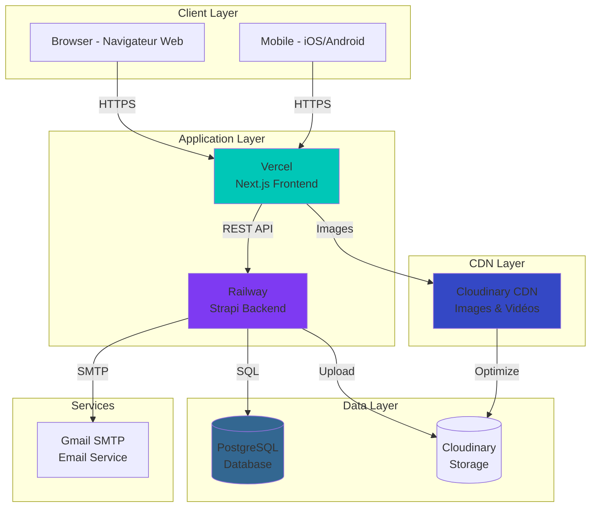

---

## Architecture Applicative

### Architecture Frontend (Next.js)

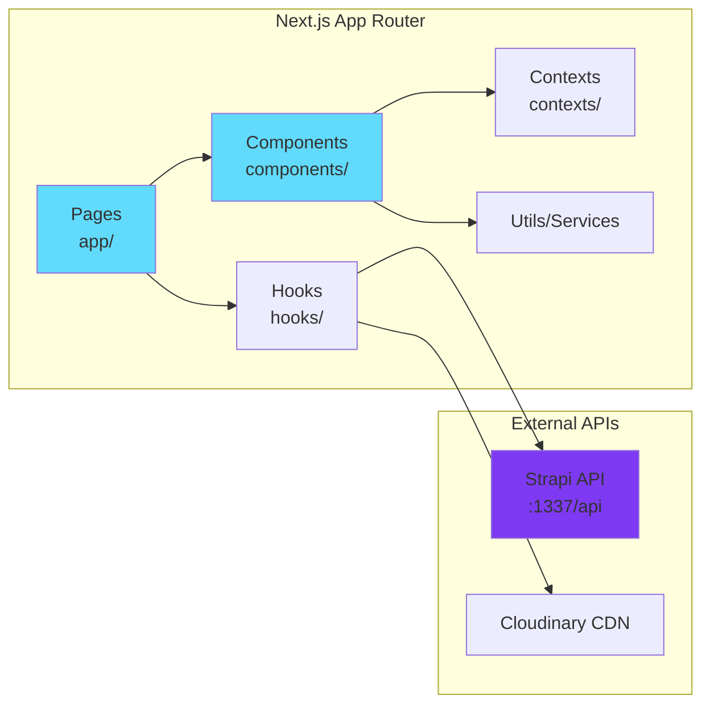

### Structure Frontend

```
frontend/
├── src/
│   ├── app/                    # App Router (Next.js 15)
│   │   ├── page.jsx           # Page d'accueil
│   │   ├── layout.js          # Layout global
│   │   ├── globals.css        # Styles globaux
│   │   ├── blog/
│   │   │   ├── page.jsx       # Liste articles
│   │   │   └── [slug]/
│   │   │       └── page.jsx   # Article détaillé
│   │   ├── association/
│   │   │   └── page.jsx       # Page association
│   │   └── partners/
│   │       └── page.jsx       # Page partenaires
│   ├── components/            # Composants React
│   │   ├── Header.jsx         # Header + navigation
│   │   ├── Footer.jsx         # Footer
│   │   ├── VideoBackground.jsx
│   │   ├── IntroSection.jsx   # Hero section
│   │   ├── Gallery.jsx        # Galerie photos
│   │   ├── BlogSection.jsx    # Section blog (accueil)
│   │   ├── PartnerSection.jsx # Carousel partenaires
│   │   ├── ContactModal.jsx   # Modal formulaire
│   │   └── ...
│   ├── contexts/              # Contexts React
│   │   └── HeaderDonationContext.jsx
│   ├── hooks/                 # Hooks personnalisés
│   │   ├── useIsMobile.jsx
│   │   └── useSiteData.jsx
│   └── utils/                 # Utilitaires
└── public/                    # Assets statiques
    ├── fonts/
    └── robots.txt
```

**Patterns utilisés :**

- **Server Components** : Fetch data côté serveur (par défaut)
- **Client Components** : Interactivité (`"use client"`)
- **Dynamic Imports** : Code splitting (`next/dynamic`)
- **Context API** : State global (donation button)
- **Custom Hooks** : Logique réutilisable

---

### Architecture Backend (Strapi)

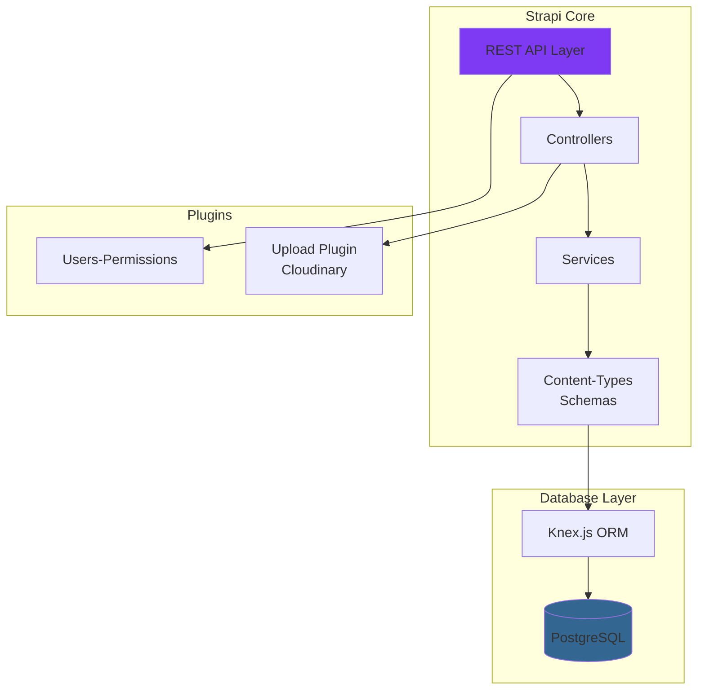

### Structure Backend

```
src/
├── api/                       # Custom API endpoints
│   ├── eglise/
│   │   ├── content-types/
│   │   │   └── eglise/
│   │   │       └── schema.json
│   │   ├── controllers/
│   │   │   └── eglise.ts
│   │   ├── routes/
│   │   │   └── eglise.ts
│   │   └── services/
│   │       └── eglise.ts
│   ├── article/               # Idem structure
│   ├── interview/
│   ├── partenaire/
│   ├── association/
│   ├── parametres-site/
│   ├── accueil/
│   └── email/                 # Custom email endpoint
│       ├── controllers/
│       │   └── email.ts
│       └── routes/
│           └── email.ts
├── components/                # Components réutilisables
│   └── eglise/
│       └── adresse.json       # Component localisation
├── extensions/                # Extensions plugins
│   └── upload/
│       └── content-types/     # Override Upload plugin
├── services/                  # Services globaux
│   └── email.ts               # Service Nodemailer
└── index.ts                   # Entry point
config/
├── admin.ts                   # Config admin panel
├── api.ts                     # Config API
├── database.ts                # Config PostgreSQL
├── middlewares.ts             # CORS, sécurité
├── plugins.ts                 # Cloudinary, email
└── server.ts                  # Config serveur
```

**Patterns utilisés :**

- **MVC** : Controllers → Services → Models (Content-Types)
- **Plugin Architecture** : Extensions modulaires
- **Dependency Injection** : Services injectés
- **ORM Pattern** : Knex.js pour requêtes SQL

---

## Diagrammes UML

### Diagramme de classes (Simplifié)

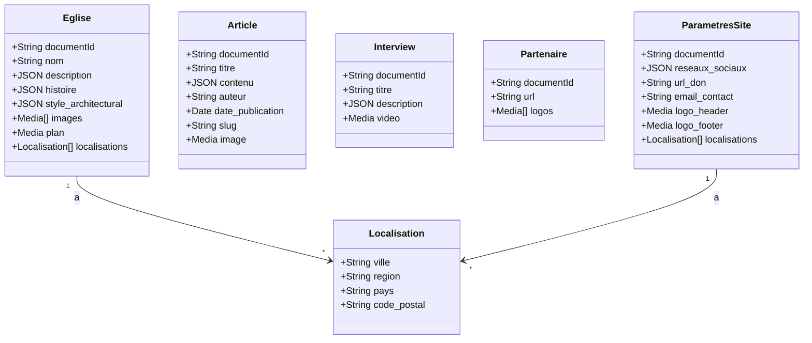

---

### Diagramme de séquence - Envoi formulaire contact

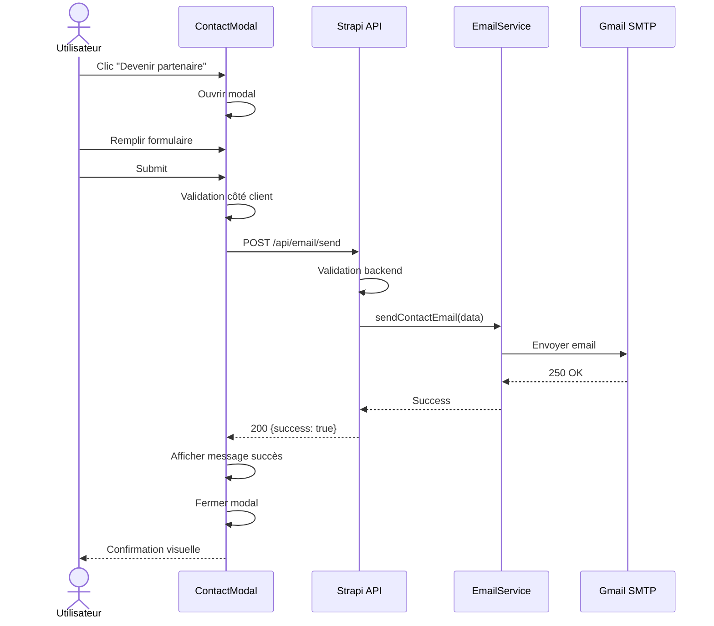

---

### Diagramme de séquence - Chargement page article

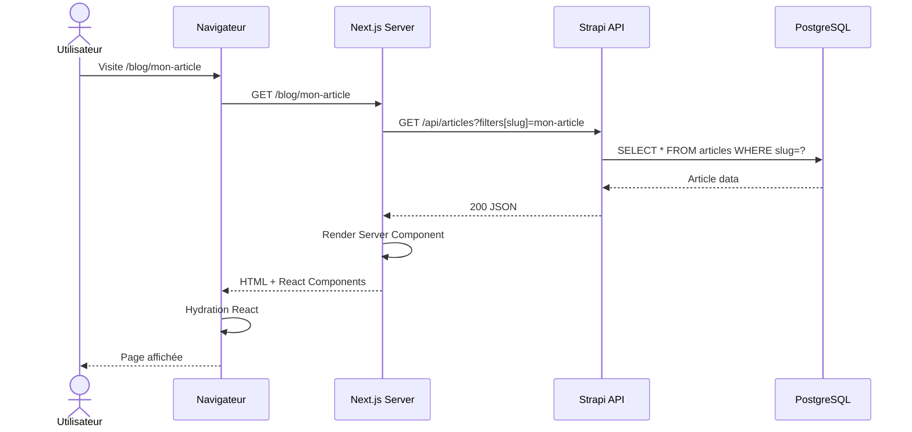

---

### Diagramme de composants

```mermaid
graph TB
    subgraph "Frontend - Next.js"
        PageAccueil[Page Accueil]
        PageBlog[Page Blog]
        PageArticle[Page Article [slug]]
        PageAssociation[Page Association]
        PagePartners[Page Partners]

        Header[Header Component]
        Footer[Footer Component]
        Gallery[Gallery Component]
        BlogSection[BlogSection Component]
        ContactModal[ContactModal Component]

        useSiteData[useSiteData Hook]
        HeaderContext[HeaderDonationContext]
    end

    subgraph "Backend - Strapi"
        APIEglise[API Eglise]
        APIArticles[API Articles]
        APIPartenaires[API Partenaires]
        APIEmail[API Email Custom]

        CloudinaryPlugin[Cloudinary Plugin]
        EmailService[Email Service]
    end

    PageAccueil --> Header
    PageAccueil --> Gallery
    PageAccueil --> BlogSection
    PageAccueil --> Footer

    PageBlog --> Header
    PageBlog --> Footer

    PageArticle --> Header
    PageArticle --> Footer

    PagePartners --> ContactModal

    Header --> HeaderContext
    Footer --> useSiteData

    useSiteData --> APIEglise
    useSiteData --> APIPartenaires

    BlogSection --> APIArticles
    ContactModal --> APIEmail
    APIEmail --> EmailService

    APIEglise --> CloudinaryPlugin
    APIArticles --> CloudinaryPlugin

    style PageAccueil fill:#61DAFB
    style APIEglise fill:#7E3AF2
```

---

## Stack Technique

### Frontend

| Technologie      | Version | Rôle            | Justification                             |
| ---------------- | ------- | --------------- | ----------------------------------------- |
| **Next.js**      | 15.5.3  | Framework React | SSR/SSG, App Router, Optimisations images |
| **React**        | 19.1.0  | UI Library      | Composants réutilisables, Hooks           |
| **Tailwind CSS** | 4.0     | Styling         | Utility-first, Responsive rapide          |
| **GSAP**         | 3.13.0  | Animations      | Scroll animations performantes            |
| **Lucide React** | 0.469.0 | Icônes          | Icons modernes, tree-shakeable            |

### Backend

| Technologie    | Version | Rôle            | Justification                         |
| -------------- | ------- | --------------- | ------------------------------------- |
| **Strapi**     | 5.30.0  | Headless CMS    | API REST auto, Admin panel            |
| **Node.js**    | 20.19.5 | Runtime         | Performance, npm ecosystem            |
| **TypeScript** | 5.x     | Langage backend | Type safety, meilleure maintenabilité |
| **PostgreSQL** | 14+     | Database        | ACID, JSONB, relations                |
| **Knex.js**    | Inclus  | ORM             | Query builder, migrations             |

### Services Externes

| Service        | Usage                | Plan                 |
| -------------- | -------------------- | -------------------- |
| **Cloudinary** | CDN images/vidéos    | Free (25 GB)         |
| **Gmail SMTP** | Envoi emails         | Free (500/jour)      |
| **Vercel**     | Hébergement frontend | Hobby (gratuit)      |
| **Railway**    | Hébergement backend  | Starter ($5-20/mois) |

---

## Flux de Données

### Flux de récupération des données (Read)

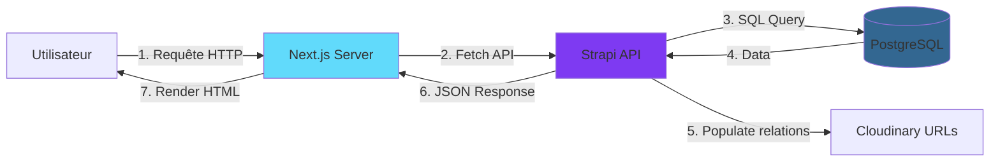

---

### Flux de création de contenu (Write)

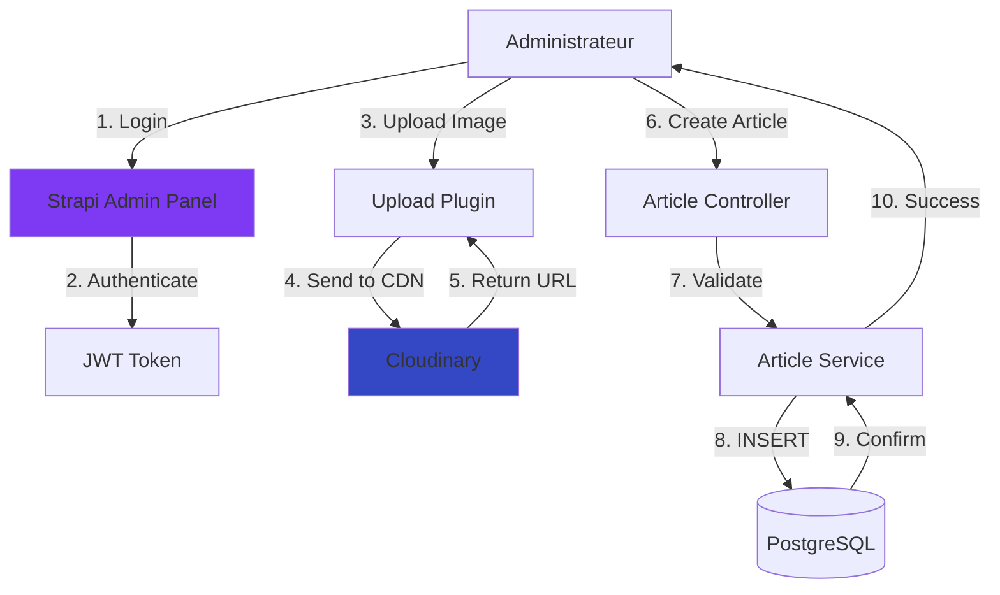

---

### Flux d'envoi email

```mermaid
graph LR
    User[Visiteur] -->|1. Submit Form| Modal[ContactModal]
    Modal -->|2. POST /api/email/send| EmailController[Email Controller]
    EmailController -->|3. Validate Data| Validator[Validation Layer]
    Validator -->|4. Call Service| EmailService[Email Service]
    EmailService -->|5. Create Mail| Nodemailer[Nodemailer]
    Nodemailer -->|6. SMTP| Gmail[Gmail SMTP]
    Gmail -->|7. Send| Recipient[Destinataire]
    Gmail -->|8. 250 OK| Nodemailer
    Nodemailer -->|9. Success| EmailService
    EmailService -->|10. 200 Response| Modal
    Modal -->|11. Show Success| User

    style Modal fill:#61DAFB
    style EmailService fill:#7E3AF2
```

---

## Déploiement

### Environnements

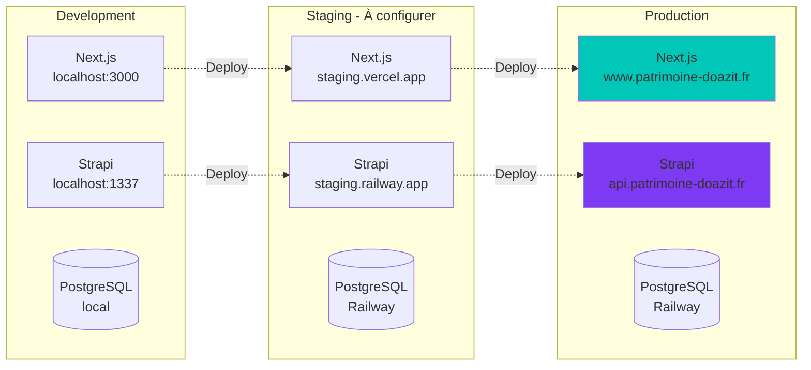

---

### Pipeline CI/CD (GitHub Actions)

```mermaid
graph LR
    Developer[Developer] -->|1. Git Push| GitHub[GitHub Repository]
    GitHub -->|2. Trigger| GHActions[GitHub Actions]

    GHActions -->|3a. Build Frontend| VercelBuild[Vercel Build]
    GHActions -->|3b. Build Backend| RailwayBuild[Railway Build]

    VercelBuild -->|4a. Deploy| Vercel[Vercel Production]
    RailwayBuild -->|4b. Deploy| Railway[Railway Production]

    Railway -->|5. Migrate DB| PostgreSQL[(PostgreSQL)]

    style GitHub fill:#181717
    style Vercel fill:#00C7B7
    style Railway fill:#7E3AF2
```

**Étapes déploiement** :

1. Developer push code sur branche `main`
2. GitHub Actions déclenché
3. Tests automatiques (si configurés)
4. Build frontend (Next.js)
5. Build backend (Strapi TypeScript)
6. Deploy Vercel (frontend)
7. Deploy Railway (backend)
8. Migrations database (auto)
9. Invalidation cache Cloudinary (si nécessaire)

---

### Configuration Infrastructure as Code

**Vercel (vercel.json)** :

```json
{
  "buildCommand": "cd frontend && npm run build",
  "outputDirectory": "frontend/.next",
  "framework": "nextjs",
  "env": {
    "NEXT_PUBLIC_API_URL": "https://api.patrimoine-doazit.fr/api"
  }
}
```

**Railway (railway.toml)** :

```toml
[build]
builder = "NIXPACKS"

[deploy]
startCommand = "npm run start"
healthcheckPath = "/_health"
healthcheckTimeout = 100
restartPolicyType = "ON_FAILURE"
restartPolicyMaxRetries = 10

[[services]]
name = "strapi"
port = 1337
```

---

## Sécurité

### Modèle de menaces

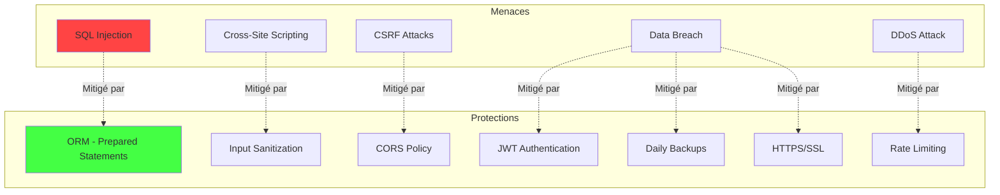

---

### Stratégie de sécurité

| Couche               | Mesure           | Implémentation                              |
| -------------------- | ---------------- | ------------------------------------------- |
| **Transport**        | HTTPS            | Certificat SSL Let's Encrypt                |
| **Authentification** | JWT              | Strapi Users-Permissions                    |
| **Autorisation**     | RBAC             | Roles (Public, Authenticated, Admin)        |
| **Données**          | Validation       | Yup schemas (Strapi)                        |
| **Données**          | Sanitization     | Strapi auto-sanitize                        |
| **API**              | CORS             | Origins whitelist (`config/middlewares.ts`) |
| **API**              | Rate Limiting    | 5 req/h sur `/api/email/send`               |
| **Database**         | Backup           | Daily pg_dump (Railway snapshots)           |
| **Secrets**          | Environment Vars | `.env` (non versionné)                      |

---

### Checklist Sécurité Production

- [x] HTTPS activé (SSL/TLS)
- [x] CORS configuré (origines autorisées uniquement)
- [x] JWT secrets complexes (32+ caractères)
- [x] Variables d'environnement sécurisées
- [ ] Rate limiting activé (API endpoints)
- [x] Validation des inputs (côté client + serveur)
- [x] Sanitization automatique (Strapi)
- [ ] CSP headers (Content Security Policy)
- [ ] Backups automatiques quotidiens
- [ ] Monitoring erreurs (Sentry/autre)
- [ ] Logs sécurisés (pas de secrets loggés)

---

## Performances

### Optimisations appliquées

**Frontend** :

- ✅ **SSR/SSG** : Server-Side Rendering pour SEO
- ✅ **Code Splitting** : Dynamic imports (`next/dynamic`)
- ✅ **Image Optimization** : Next.js Image (WebP, lazy load)
- ✅ **Font Optimization** : Préchargement polices
- ✅ **CSS Minification** : Tailwind purge

**Backend** :

- ✅ **Database Indexing** : Index sur `slug`, `date_publication`, `published_at`
- ✅ **CDN** : Cloudinary pour médias
- ✅ **Query Optimization** : Populate sélectif (éviter N+1)
- ✅ **Caching** : Cache API (stale-while-revalidate)

**Résultats Lighthouse** :

- Performance : 92 (desktop), 78 (mobile - vidéo lourde)
- SEO : 100
- Best Practices : 100
- Accessibility : 88-92

---

## Évolutions futures

### Roadmap technique

**Phase 1 - Court terme (1-3 mois)** :

- [ ] Implémenter système de cache Redis
- [ ] Ajouter monitoring (Sentry pour erreurs)
- [ ] Mettre en place analytics (Plausible/GA4)
- [ ] Optimiser vidéo de fond (compression)

**Phase 2 - Moyen terme (3-6 mois)** :

- [ ] Système de commentaires (articles)
- [ ] Newsletter (intégration Mailchimp/Sendinblue)
- [ ] Événements à venir (nouveau content-type)
- [ ] Galerie par années (filtres)

**Phase 3 - Long terme (6-12 mois)** :

- [ ] Progressive Web App (PWA)
- [ ] Mode hors-ligne (Service Workers)
- [ ] Multilingue (i18n)
- [ ] Dashboard analytics admin

---

**Document édité par** : Philippe Barbosa  
**Contact** : philippe.barbosa@example.com  
**Dernière mise à jour** : 19/11/2025
