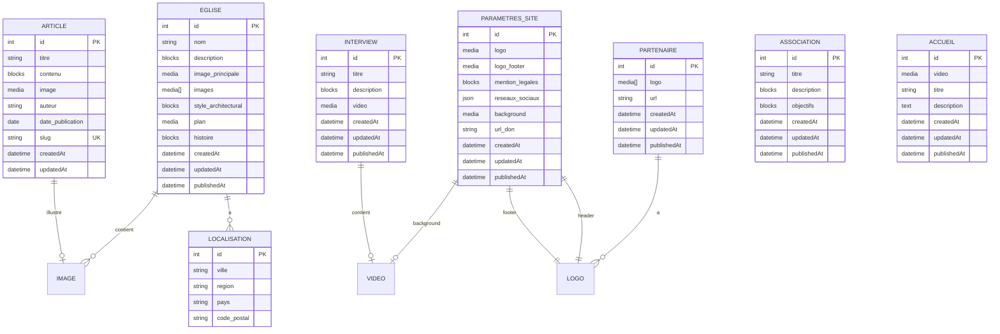

# 🗄️ Modèle de Données - Association Patrimoine de Doazit

> Schéma de base de données PostgreSQL via Strapi v5

---

## 📊 Diagramme Entité-Association (Mermaid)



---

## 📋 Dictionnaire de Données

### Table : `eglises` (Single Type)

| Champ                 | Type           | Contraintes            | Description                       |
| --------------------- | -------------- | ---------------------- | --------------------------------- |
| `id`                  | INTEGER        | PK, AUTO_INCREMENT     | Identifiant unique                |
| `nom`                 | VARCHAR(255)   | NOT NULL               | Nom de l'église                   |
| `description`         | JSONB (blocks) | NOT NULL               | Description détaillée (rich text) |
| `image_principale`    | INTEGER        | FK → `files`, NOT NULL | Image principale                  |
| `images`              | INTEGER[]      | FK → `files`           | Galerie d'images                  |
| `style_architectural` | JSONB (blocks) | NULL                   | Description du style              |
| `plan`                | INTEGER        | FK → `files`           | Plan architectural                |
| `histoire`            | JSONB (blocks) | NULL                   | Histoire de l'église              |
| `createdAt`           | TIMESTAMP      | DEFAULT NOW()          | Date de création                  |
| `updatedAt`           | TIMESTAMP      | DEFAULT NOW()          | Date de modification              |
| `publishedAt`         | TIMESTAMP      | NULL                   | Date de publication               |

---

### Table : `articles` (Collection Type)

| Champ              | Type           | Contraintes        | Description             |
| ------------------ | -------------- | ------------------ | ----------------------- |
| `id`               | INTEGER        | PK, AUTO_INCREMENT | Identifiant unique      |
| `titre`            | VARCHAR(255)   | NULL               | Titre de l'article      |
| `contenu`          | JSONB (blocks) | NULL               | Contenu (rich text)     |
| `image`            | INTEGER        | FK → `files`       | Image d'illustration    |
| `auteur`           | VARCHAR(255)   | NULL               | Nom de l'auteur         |
| `date_publication` | DATE           | NULL               | Date de publication     |
| `slug`             | VARCHAR(255)   | UNIQUE             | URL-friendly identifier |
| `createdAt`        | TIMESTAMP      | DEFAULT NOW()      | Date de création        |
| `updatedAt`        | TIMESTAMP      | DEFAULT NOW()      | Date de modification    |

**Index :**

- UNIQUE INDEX sur `slug`
- INDEX sur `date_publication` (tri DESC)

---

### Table : `interviews` (Collection Type)

| Champ         | Type           | Contraintes        | Description             |
| ------------- | -------------- | ------------------ | ----------------------- |
| `id`          | INTEGER        | PK, AUTO_INCREMENT | Identifiant unique      |
| `titre`       | VARCHAR(255)   | NULL               | Titre de l'interview    |
| `description` | JSONB (blocks) | NULL               | Description (rich text) |
| `video`       | INTEGER        | FK → `files`       | Fichier vidéo           |
| `createdAt`   | TIMESTAMP      | DEFAULT NOW()      | Date de création        |
| `updatedAt`   | TIMESTAMP      | DEFAULT NOW()      | Date de modification    |
| `publishedAt` | TIMESTAMP      | NULL               | Date de publication     |

---

### Table : `partenaires` (Collection Type)

| Champ         | Type         | Contraintes        | Description            |
| ------------- | ------------ | ------------------ | ---------------------- |
| `id`          | INTEGER      | PK, AUTO_INCREMENT | Identifiant unique     |
| `logo`        | INTEGER[]    | FK → `files`       | Logos du partenaire    |
| `url`         | VARCHAR(500) | NULL               | Site web du partenaire |
| `createdAt`   | TIMESTAMP    | DEFAULT NOW()      | Date de création       |
| `updatedAt`   | TIMESTAMP    | DEFAULT NOW()      | Date de modification   |
| `publishedAt` | TIMESTAMP    | NULL               | Date de publication    |

---

### Table : `associations` (Single Type)

| Champ         | Type           | Contraintes        | Description                  |
| ------------- | -------------- | ------------------ | ---------------------------- |
| `id`          | INTEGER        | PK, AUTO_INCREMENT | Identifiant unique           |
| `titre`       | VARCHAR(255)   | NULL               | Titre de la page             |
| `description` | JSONB (blocks) | NULL               | Description de l'association |
| `objectifs`   | JSONB (blocks) | NULL               | Objectifs et missions        |
| `createdAt`   | TIMESTAMP      | DEFAULT NOW()      | Date de création             |
| `updatedAt`   | TIMESTAMP      | DEFAULT NOW()      | Date de modification         |
| `publishedAt` | TIMESTAMP      | NULL               | Date de publication          |

---

### Table : `accueils` (Single Type)

| Champ         | Type         | Contraintes        | Description          |
| ------------- | ------------ | ------------------ | -------------------- |
| `id`          | INTEGER      | PK, AUTO_INCREMENT | Identifiant unique   |
| `video`       | INTEGER      | FK → `files`       | Vidéo de fond        |
| `titre`       | VARCHAR(255) | NULL               | Titre principal      |
| `description` | TEXT         | NULL               | Slogan/description   |
| `createdAt`   | TIMESTAMP    | DEFAULT NOW()      | Date de création     |
| `updatedAt`   | TIMESTAMP    | DEFAULT NOW()      | Date de modification |
| `publishedAt` | TIMESTAMP    | NULL               | Date de publication  |

---

### Table : `parametres_sites` (Single Type)

| Champ             | Type           | Contraintes        | Description               |
| ----------------- | -------------- | ------------------ | ------------------------- |
| `id`              | INTEGER        | PK, AUTO_INCREMENT | Identifiant unique        |
| `logo`            | INTEGER        | FK → `files`       | Logo header               |
| `logo_footer`     | INTEGER        | FK → `files`       | Logo footer               |
| `mention_legales` | JSONB (blocks) | NULL               | Mentions légales          |
| `reseaux_sociaux` | JSONB          | NULL               | Liste des réseaux sociaux |
| `background`      | INTEGER        | FK → `files`       | Image de fond             |
| `url_don`         | VARCHAR(500)   | NULL               | Lien pour les dons        |
| `createdAt`       | TIMESTAMP      | DEFAULT NOW()      | Date de création          |
| `updatedAt`       | TIMESTAMP      | DEFAULT NOW()      | Date de modification      |
| `publishedAt`     | TIMESTAMP      | NULL               | Date de publication       |

**Structure JSON `reseaux_sociaux` :**

```json
[
  {
    "nom": "Facebook",
    "url": "https://facebook.com/..."
  },
  {
    "nom": "Instagram",
    "url": "https://instagram.com/..."
  }
]
```

---

### Composant : `eglise.adresse`

| Champ         | Type         | Description     |
| ------------- | ------------ | --------------- |
| `ville`       | VARCHAR(255) | Nom de la ville |
| `region`      | VARCHAR(255) | Région          |
| `pays`        | VARCHAR(255) | Pays            |
| `code_postal` | VARCHAR(10)  | Code postal     |

---

### Table Strapi : `files` (Gestion médias)

| Champ               | Type         | Description                                       |
| ------------------- | ------------ | ------------------------------------------------- |
| `id`                | INTEGER      | PK                                                |
| `name`              | VARCHAR(255) | Nom du fichier                                    |
| `alternativeText`   | VARCHAR(255) | Texte alternatif                                  |
| `caption`           | VARCHAR(255) | Légende                                           |
| `width`             | INTEGER      | Largeur (images)                                  |
| `height`            | INTEGER      | Hauteur (images)                                  |
| `formats`           | JSONB        | Formats générés (thumbnail, small, medium, large) |
| `hash`              | VARCHAR(255) | Hash unique                                       |
| `ext`               | VARCHAR(10)  | Extension (.jpg, .png, .mp4)                      |
| `mime`              | VARCHAR(255) | Type MIME                                         |
| `size`              | DECIMAL      | Taille en Ko                                      |
| `url`               | VARCHAR(500) | URL Cloudinary                                    |
| `provider`          | VARCHAR(50)  | 'cloudinary'                                      |
| `provider_metadata` | JSONB        | Métadonnées Cloudinary                            |
| `createdAt`         | TIMESTAMP    | Date d'upload                                     |
| `updatedAt`         | TIMESTAMP    | Date de modification                              |

---

## 🔗 Relations entre tables

### Relations One-to-Many (1:N)

- `EGLISE` → `LOCALISATION` (repeatable component)
- `EGLISE` → `IMAGE` (galerie multiple)
- `PARTENAIRE` → `LOGO` (logos multiples)

### Relations One-to-One (1:1)

- `EGLISE` → `IMAGE_PRINCIPALE`
- `EGLISE` → `PLAN`
- `ARTICLE` → `IMAGE`
- `INTERVIEW` → `VIDEO`
- `PARAMETRES_SITE` → `LOGO`
- `PARAMETRES_SITE` → `LOGO_FOOTER`
- `PARAMETRES_SITE` → `BACKGROUND`

### Pas de relations Many-to-Many

- Architecture simplifiée pour ce projet

---

## 🔐 Contraintes et Validations

### Contraintes d'intégrité

- **NOT NULL** : `eglise.nom`, `eglise.description`, `eglise.image_principale`
- **UNIQUE** : `article.slug`
- **Foreign Keys** : Toutes les colonnes `media` pointent vers `files.id`

### Validations Strapi

- **Formats médias autorisés** : images, files, videos, audios
- **Types de champs** :
  - `string` : VARCHAR(255)
  - `text` : TEXT
  - `blocks` : JSONB (Strapi Rich Text)
  - `date` : DATE
  - `datetime` : TIMESTAMP

---

## 📈 Volumétrie Estimée

| Table              | Type       | Volume estimé    |
| ------------------ | ---------- | ---------------- |
| `eglises`          | Single     | 1 enregistrement |
| `articles`         | Collection | 10-50 articles   |
| `interviews`       | Collection | 5-20 interviews  |
| `partenaires`      | Collection | 5-30 partenaires |
| `associations`     | Single     | 1 enregistrement |
| `accueils`         | Single     | 1 enregistrement |
| `parametres_sites` | Single     | 1 enregistrement |
| `files`            | Media      | 100-500 fichiers |

---

## 🗂️ Index et Performance

### Index automatiques Strapi

- Primary Keys : `id` (auto-increment)
- Unique constraints : `article.slug`
- Foreign Keys : Toutes les relations media

### Index recommandés

```sql
-- Articles triés par date
CREATE INDEX idx_articles_date ON articles(date_publication DESC);

-- Recherche par slug
CREATE UNIQUE INDEX idx_articles_slug ON articles(slug);

-- Médias publiés
CREATE INDEX idx_published ON articles(publishedAt) WHERE publishedAt IS NOT NULL;
```

---

## 🔄 Triggers et Automatisations

### Strapi Lifecycle Hooks

- `beforeCreate` : Génération automatique du slug (articles)
- `beforeUpdate` : Mise à jour `updatedAt`
- `afterCreate` : Upload Cloudinary pour médias

### Exemple : Génération de slug

```javascript
// src/api/article/content-types/article/lifecycles.js
module.exports = {
  beforeCreate(event) {
    const { data } = event.params;
    if (data.titre && !data.slug) {
      data.slug = slugify(data.titre, { lower: true, strict: true });
    }
  },
};
```

---

## 📦 Backup et Restauration

### Stratégie de sauvegarde

- **Base de données** : Dump PostgreSQL quotidien
- **Médias Cloudinary** : Synchronisation automatique
- **Configuration Strapi** : Versioning Git

### Commandes

```bash
# Backup PostgreSQL
pg_dump -U postgres apd_db > backup_$(date +%Y%m%d).sql

# Restore
psql -U postgres apd_db < backup_20251119.sql
```

---

## 🚀 Évolutions Futures

### Extensions possibles

- [ ] Table `evenements` (événements à venir)
- [ ] Table `dons` (suivi des donations)
- [ ] Table `newsletter` (abonnés)
- [ ] Système de commentaires sur articles
- [ ] Galerie photos par année/événement
- [ ] Historique des restaurations

---

**Ce modèle de données couvre tous les besoins fonctionnels du projet APD avec une structure normalisée et évolutive.**
